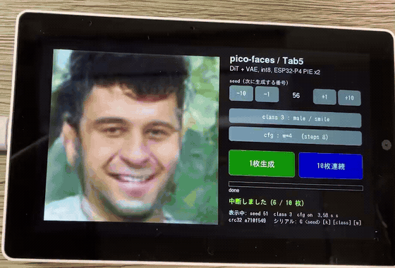

# pico-faces on M5Stack Tab5

[cpldcpu/pico-faces](https://github.com/cpldcpu/pico-faces) を **M5Stack Tab5（ESP32-P4）** で動かすファームウェアです。

[](https://x.com/nnn112358/status/2096576075551908014/video/1)

動画: [X の投稿](https://x.com/nnn112358/status/2096576075551908014/video/1)（39 秒）／
[docs/media/demo.mp4](docs/media/demo.mp4)（同じ動画。上の GIF は冒頭 12 秒です）

## 元のリポジトリについて

pico-faces は、Raspberry Pi Pico 2（RP2350）のようなマイコンで顔画像を生成する小さな拡散モデルです。

- 潜在空間で動く拡散トランスフォーマー（DiT、約 2.4M パラメータ）と、潜在を 128×128 の RGB 画像に戻す VAE デコーダから成ります。
- 重みも計算もすべて int8 の整数演算で、推論エンジンは移植しやすい C99 で書かれています。
- 条件は「性別 × 笑顔」の 4 クラスと無条件の計 5 つで、classifier-free guidance（CFG）の強さも選べます。
- 生成は seed ごとに決定的で、同じ seed なら PC でもマイコンでも 1 bit も違わない画像になります。

この移植では、その推論エンジンを**無改変**のまま ESP-IDF でビルドし、Tab5 の画面・タッチ・USB シリアルと、
ESP32-P4 の SIMD 命令（PIE）による高速化を足しています。

## 使い方

### 用意するもの

- M5Stack Tab5
- ESP-IDF v5.5（`~/esp/esp-idf` に展開してあるものを `idf.sh` が使います）
- `uv`（ビルド中に Python スクリプトを 1 本走らせます）

### ビルドと書き込み

```bash
git submodule update --init         # 上流を取る（約 300 MB。モデルの重みを含む）
./idf.sh build
./idf.sh -p /dev/ttyACM0 flash
```

### 操作

起動すると seed 3 で 1 枚生成して表示します（8 ステップ、male / smile、cfg none）。
右パネルのボタンで seed と条件を選んで生成します。既定の cfg none は約 2 秒で 1 枚、
cfg を w=4 / 6 / 8 にすると guidance が効く代わりに約 3.5 秒かかります。

| ボタン | 動作 |
|---|---|
| `-10` `-1` `+1` `+10` | 次に生成する seed を増減（中央に表示） |
| `class : ...` | クラスを切り替え（female/no-smile → female/smile → male/no-smile → male/smile → null） |
| `cfg : ...` | CFG を切り替え（none → w=4 → 6 → 8 → none） |
| **1枚生成** | 表示中の seed で 1 枚生成し、seed を 1 進める（左の画像をタップしても同じ） |
| **10枚連続** | seed から 10 枚を順に生成し、seed を 10 進める。途中で画面を触ると中断 |

seed と条件が同じなら毎回同じ顔になります（生成は決定的です）。別の顔にしたいときは seed を変えてください。

USB シリアル（115200）からは上流の Pico 版と同じ書式で指示できます。

```
G <seed> [k_steps] [class] [w] [count]   生成。class / w を省略すると上流の golden の規約。
                                         count（既定 1）枚を seed から順に生成
I                                        モデル情報
```

応答は `OK seed=1 k=4 class=1 w=4 crc32=40c5e5a0 ms=2023` のような 1 行です。
`crc32` が上流の golden と一致すれば bit 単位で正しく動いています（値は [docs/details.md](docs/details.md)）。

⚠️ `cat` や `printf` でシリアルポートを開閉すると ESP32-P4 がダウンロードモードに落ちることがあります。
`tools/serial_cmd.py` を使ってください。

```bash
uv run --no-project --with pyserial python tools/serial_cmd.py --boot 14 --wait 10 "G 1 4"
```

## 推論速度


Tab5（ESP32-P4 360 MHz × 2 コア）で 1 枚を生成する時間です。2 つのモデルそれぞれを、PIE なし（参照 C、
`-DPF_PIE=0`）と PIE 版で測りました。どの組み合わせでも生成される画像は同じです（CRC32 が一致）。

### m3_decD_deep_full（既定。DiT 深さ 12、blob 4.02 MB）

| 設定 | PIE なし | PIE 版 | 倍率 |
|---|---:|---:|---:|
| K=4、cfg none | 5.99 s | **1.27 s** | 4.7× |
| K=4、cfg w=4（golden の規約） | 10.11 s | **2.02 s** | 5.0× |
| K=8、cfg none（起動時の既定） | 10.09 s | **2.03 s** | 5.0× |
| K=8、cfg w=6 | 18.30 s | **3.52 s** | 5.2× |

### m3_long_cfg（`-DPF_MODEL=m3_long_cfg`。DiT 深さ 8、blob 2.57 MB）

| 設定 | PIE なし | PIE 版 | 倍率 |
|---|---:|---:|---:|
| K=4、cfg none | 3.39 s | **0.75 s** | 4.5× |
| K=4、cfg w=4（golden の規約） | 6.14 s | **1.27 s** | 4.8× |
| K=8、cfg none | 6.17 s | **1.29 s** | 4.8× |
| K=8、cfg w=6 | 11.70 s | **2.35 s** | 5.0× |

- K はステップ数（Euler）。cfg none は 1 ステップに DiT を 1 回、cfg w=… は 2 回通します。
- 時間はシリアルの `G` コマンドが返す `ms=`（生成の開始から CRC 計算まで。表示は含みません）です。
- 上流の RP2350 @300 MHz は m3_decD_deep_full の K=4 w=4 で約 10 秒です。
- 測定のしかたは [docs/details.md](docs/details.md) にあります。

## 詳しい内容

構成、PIE 版カーネルの仕組み、自己テスト、bit 一致の確認手順、測定結果、既知の問題は
[docs/details.md](docs/details.md) にまとめてあります。

## ライセンス

このリポジトリのコードと文書（`main/`、`components/`、`tools/`、`docs/`）は [MIT ライセンス](LICENSE)です。

上流の cpldcpu/pico-faces（推論エンジンとモデルの重み。`upstream/` の submodule として参照）には
ライセンス表記がありません（2026-09-06 時点）。上流部分の利用条件は上流の作者に従ってください。
